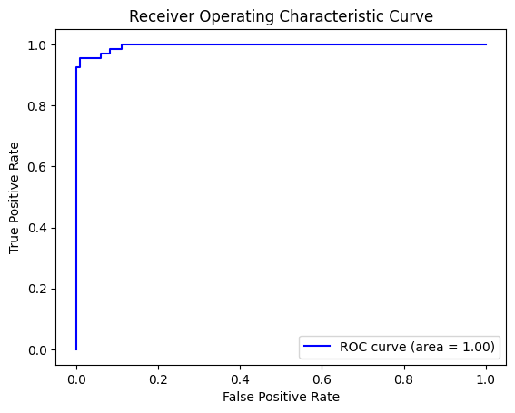
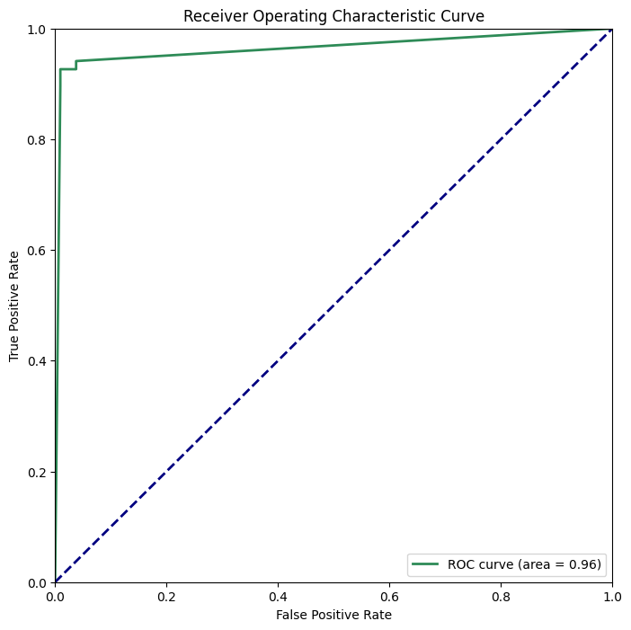

# Cancer Diagnosis Using Machine Learning

**Author**: Kyle-Anthony Hay  
**Class**: CSCI-49376 – Big Data  
**Professor**: You Wu

## Overview 🔎

This project explores the use of machine learning algorithms for cancer diagnosis. Two primary algorithms, Random Forest and Logistic Regression, were applied to a dataset for binary classification of cancer as benign (B) or malignant (M).

### Random Forest Algorithm 🌳 (96% Accuracy)

**Justification**: Chosen for its robustness against noise in datasets with a high number of features and its ability to handle non-linear relationships.

**Procedure**:

1. Represented diagnosis with integers in a new column “indexeddiagnosis”.
2. Assembled dataset columns into a column vector “features”.
3. Utilized a RandomForestClassifier with “indexeddiagnosis” and “features”.
4. Trained the model on the training data and made predictions on test data.

**Results**:

- Test Accuracy: 96.38%
- F1 Score: 96.35%
- Precision: 96.59%
- Recall: 96.38%
- ROC AUC: 99.59%

### Logistic Regression Algorithm 📈 (94% Accuracy)

**Justification**: Selected for its binary classification capabilities, simplicity, and computational efficiency.

**Procedure**: Same as to Random Forest, with the use of a LogisticRegression model instead.

**Results**:

- Test Accuracy: 95.88%
- F1 Score: 95.89%
- Precision: 95.90%
- Recall: 95.88%
- ROC AUC: 99.29%

### Comparison

Both algorithms performed well, with Random Forest having a slight edge in accuracy. This is attributed to its better prediction capabilities in data with high variation.
